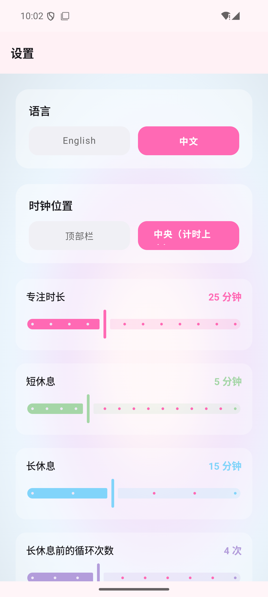
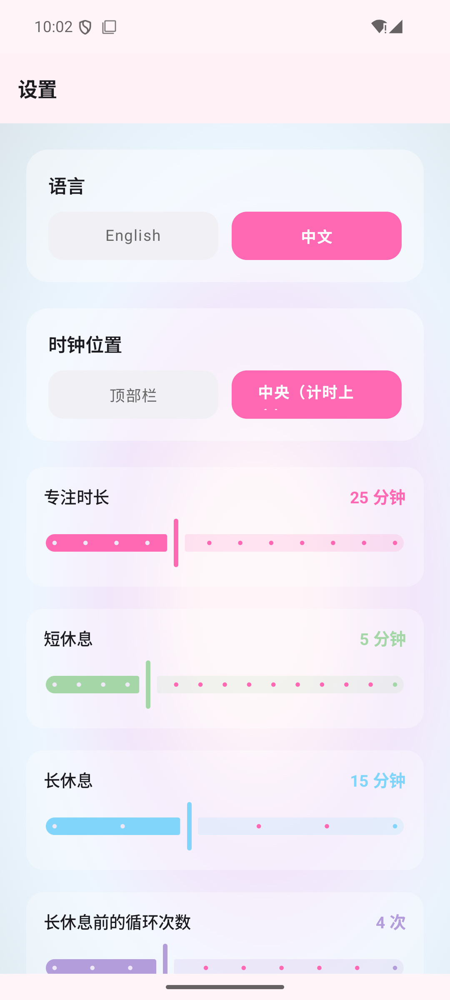
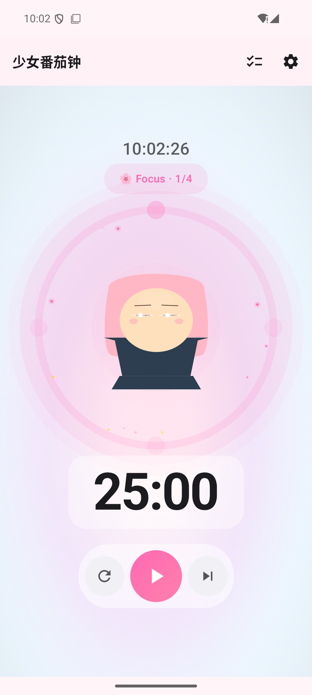
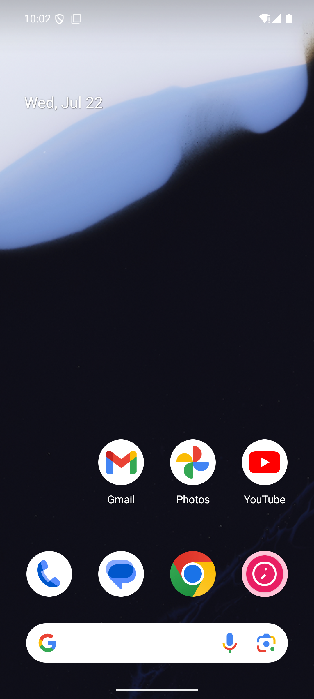

# ShoujoPomodoro · 少女番茄钟 🌸

<div align="center">

**A Dreamy Anime-Girl-Themed Pomodoro Timer for Android**

Built with Jetpack Compose & Material 3 · Premium Visual Experience

[📖 中文版本](README.md)


</div>

---

## 📸 Screenshots

<div align="center">

| Timer Main | Running | Task List |
|:---:|:---:|:---:|
|  |  |  |

| Settings | English Mode |
|:---:|:---:|
|  |  |

</div>

---

## ✨ What's New (July 2026 UI Overhaul)

The app has received a complete visual transformation — from a simple timer to a **dreamy shoujo experience**:

### 🌸 Visual Effects System

| Feature | Description |
|---------|-------------|
| **Sakura Particle System** | Cherry blossom petals, sparkles, light motes, and hearts drift across the screen in real-time. Supports 4 particle types with physics-based motion ✨ |
| **AGSL Shader Backgrounds** | GPU-accelerated gradient backgrounds — aurora waves, soft pastel gradients, and starry night skies. Smooth animated color transitions at 60fps |
| **Celebration Effects** | 5 celebration styles on pomodoro completion: Confetti burst, Golden star shower, Sakura storm, Heart explosion, and Magic sparkle transformation 🎉 |
| **Glassmorphism UI** | Semi-transparent frosted glass panels for timer display, music bar, and cards with soft blur and shadows |

### 👧 Enhanced Character System

| Feature | Description |
|---------|-------------|
| **4 Outfits** | Sailor uniform (focus), Pastel dress (short break), Magical girl (long break), Winter coat (seasonal) |
| **3 Hairstyles** | Twin tails, Long straight, Short bob — each with independent sway animations |
| **Rich Expressions** | Multi-layer eyes with highlights, dynamic blush intensity, state-based mouth shapes, eyebrow movement |
| **Glow Aura** | Pulsing colored aura around the character that changes with timer state |
| **Body Animation** | Breathing idle animation, blink (with random double-blink), micro head movements |

### ⭕ Premium Timer

| Feature | Description |
|---------|-------------|
| **Multi-layer Glow** | Progress arc with inner and outer glow rings in phase-specific colors |
| **Orbiting Particles** | Sparkles orbit around the timer ring with physics-based motion |
| **Star Progress Markers** | 4 star markers at 0%, 25%, 50%, 75% that light up as progress advances |
| **Glow Tip Dot** | A bright glowing dot at the leading edge of the progress arc |
| **Gradient Sweep** | Smooth gradient coloring along the progress arc |

### 🎛️ Premium Controls

| Feature | Description |
|---------|-------------|
| **Neumorphic Buttons** | Reset, Play/Pause, and Skip buttons with soft shadow depth |
| **Gradient Play Button** | Pink-to-coral gradient for the primary play/pause button |
| **Glass Music Bar** | Frosted glass container for the music player with rounded pill shape |

---

## ⏱️ Core Features

- Standard Pomodoro cycle: Focus (25min) → Short Break (5min) → Focus → Long Break (15min)
- Customizable durations and cycle count
- Character changes with timer state (Idle/Focusing/Resting/Alerting)
- Task management (add, complete, delete, set current)
- Background foreground service with notification alerts
- Built-in music player
- Bilingual support (English & Chinese), switch without restart
- Light/Dark theme following system settings

---

## 🛠️ Tech Stack

| Technology | Purpose |
|:-----------|:--------|
| **Kotlin 2.0** | Programming language |
| **Jetpack Compose** | Modern declarative UI toolkit |
| **Material 3** | Design system foundation |
| **Canvas API** | Custom character & particle rendering |
| **AGSL Shaders** | GPU-accelerated gradient backgrounds |
| **Room** | Local SQLite database for tasks |
| **DataStore** | Timer settings persistence |
| **Coroutines + Flow** | Reactive async data streams |
| **Navigation Compose** | In-app navigation |
| **Foreground Service** | Background timer execution |

---

## 🚀 Getting Started

### Prerequisites

- Android Studio Hedgehog (2023.1.1) or later
- Android SDK 35
- JDK 17

### Build & Run

```bash
# Clone the repository
git clone git@github.com:Crasor/ShoujoPomodoro.git
cd ShoujoPomodoro/ShoujoPomodoro

# Build APK
./gradlew assembleDebug

# Install to emulator
adb install app/build/outputs/apk/debug/app-debug.apk

# Launch the app
adb shell am start -n com.shoujopomodoro/.MainActivity
```

### System Requirements

- Minimum SDK: Android 7.0 (API 24)
- Target SDK: Android 14 (API 34)
- Compile SDK: Android 15 (API 35)

---

## 📁 Project Structure

```
app/src/main/java/com/shoujopomodoro/
├── data/
│   ├── local/              # Room database, DAO, entities
│   ├── preferences/        # DataStore preferences
│   └── repository/         # Repository pattern
├── di/                     # DI container & state holder
├── domain/
│   ├── model/              # Domain models (Task, TimerSession, CharacterState, TimerPhase)
│   └── usecase/            # Business logic
├── notification/           # Notification channels
├── service/                # Foreground service, music player
├── ui/
│   ├── component/          # Reusable composables ★
│   │   ├── SakuraParticleBackground.kt   # Cherry blossom particle system
│   │   ├── GradientBackgrounds.kt        # AGSL shader backgrounds
│   │   ├── CelebrationOverlay.kt         # Completion celebration effects
│   │   ├── EnhancedShoujoCharacter.kt    # Full-featured character rendering
│   │   ├── PremiumCircularTimer.kt       # Multi-layer glow timer
│   │   └── PremiumControls.kt            # Neumorphic buttons & labels
│   ├── navigation/         # NavGraph & routes
│   ├── screen/             # Screens + ViewModels
│   │   ├── timer/          # Main timer screen
│   │   ├── tasklist/       # Task management
│   │   └── settings/       # Settings & music
│   └── theme/              # Color palette, typography, shapes
└── util/                   # Constants, time formatter
```

---

## 🎨 Color Palette

| Color | Hex | Usage |
|-------|-----|-------|
| Sakura Pink | `#FFB7C5` | Primary |
| Sakura Deep | `#FF69B4` | Accent/Gradient |
| Wisteria | `#D8BFD8` | Secondary |
| Mermaid Blue | `#B2EBF2` | Long Break |
| Matcha Mint | `#A5D6A7` | Short Break |
| Konpeito Gold | `#FFD700` | Highlights/Stars |
| Rose Blush | `#F8BBD0` | Blush/Hearts |

---

## 📝 Usage

1. **Start focusing** — Tap the ▶️ play button on the Timer screen
2. **Manage tasks** — Tap the checklist icon to add tasks to focus on
3. **Customize** — Tap the gear icon to adjust durations, cycles, and language
4. **Background timer** — The timer keeps running via foreground service when you leave the app
5. **Get notified** — Full-screen alert pops up when a phase ends, with celebration effects

---

## 📄 License

```
MIT License · Copyright (c) 2025 Crasor

Open source with love~ Feel free to use, modify, and share! 🌸
```

---

## 👤 Authors

| Role | GitHub |
|------|--------|
| Original Author | [Crasor](https://github.com/Crasor) |
| UI Enhancement | [@lighthouse333](https://github.com/lighthouse333) |

---

<div align="center">

Made with ❤️ and Kotlin

*Stay focused, stay kawaii~* 🌸

</div>
